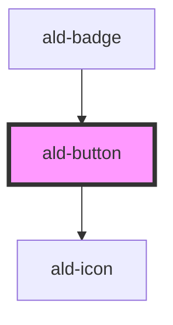

# ald-button

<!-- Auto Generated Below -->

## Properties

| Property       | Attribute       | Description                                                                   | Type                                                                                                                            | Default            |
| -------------- | --------------- | ----------------------------------------------------------------------------- | ------------------------------------------------------------------------------------------------------------------------------- | ------------------ |
| `disabled`     | `disabled`      | Sets the button state to disabled.                                            | `boolean`                                                                                                                       | `false`            |
| `fullwidth`    | `fullwidth`     | Fits to the full width of their container                                     | `boolean`                                                                                                                       | `false`            |
| `icon`         | `icon`          | Optionally give it an icon - use the icon name/class.                         | `string`                                                                                                                        | `undefined`        |
| `iconClass`    | `icon-class`    | Specify the icon class to use. Default is "material-icons".                   | `"al" \| "material-icons" \| "material-icons-outlined" \| "material-icons-round"`                                               | `'material-icons'` |
| `iconPosition` | `icon-position` | Specify the icon position. Default is "left".                                 | `"left" \| "right"`                                                                                                             | `'left'`           |
| `label`        | `label`         | The button label.                                                             | `string`                                                                                                                        | `undefined`        |
| `loading`      | `loading`       | Sets the button to a loading state - with spinning hedgehogs.                 | `boolean`                                                                                                                       | `false`            |
| `selected`     | `selected`      | Sets the button state to selected. This is used in button groups with toggle. | `boolean`                                                                                                                       | `false`            |
| `size`         | `size`          | Specify a button size. Default is medium: "md".                               | `"lg" \| "md" \| "sm" \| "xs"`                                                                                                  | `'md'`             |
| `type`         | `type`          | The button element type.                                                      | `"button" \| "reset" \| "submit"`                                                                                               | `'button'`         |
| `variant`      | `variant`       | The button variant and style.                                                 | `"danger" \| "default" \| "ghost" \| "light" \| "light-ghost" \| "link" \| "primary" \| "secondary" \| "success" \| "unstyled"` | `'default'`        |

## Dependencies

### Used by

 - [ald-badge](../badge)

### Depends on

- [ald-icon](../ald-icon)

### Graph

----------------------------------------------

*Built with [StencilJS](https://stenciljs.com/)*
