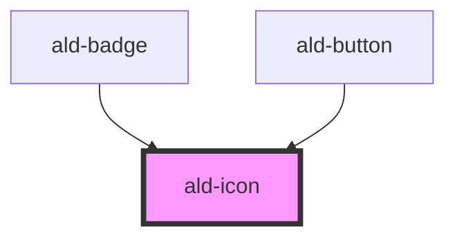

# ald-icon

<!-- Auto Generated Below -->

## Properties

| Property    | Attribute    | Description | Type                                                                              | Default            |
| ----------- | ------------ | ----------- | --------------------------------------------------------------------------------- | ------------------ |
| `color`     | `color`      |             | `string`                                                                          | `undefined`        |
| `icon`      | `icon`       |             | `string`                                                                          | `'whatshot'`       |
| `iconClass` | `icon-class` |             | `"al" \| "material-icons" \| "material-icons-outlined" \| "material-icons-round"` | `'material-icons'` |
| `opacity`   | `opacity`    |             | `number`                                                                          | `undefined`        |
| `size`      | `size`       |             | `"lg" \| "md" \| "sm" \| "xl"`                                                    | `'md'`             |

## Dependencies

### Used by

 - [ald-badge](../badge)
 - [ald-button](../ald-button)

### Graph

----------------------------------------------

*Built with [StencilJS](https://stenciljs.com/)*
