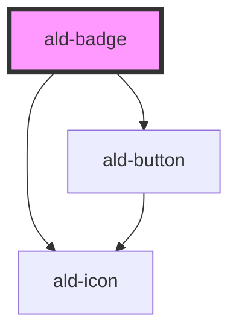

# ald-badge

<!-- Auto Generated Below -->

## Properties

| Property          | Attribute           | Description                                                                                                                                       | Type                                                                                                                                              | Default     |
| ----------------- | ------------------- | ------------------------------------------------------------------------------------------------------------------------------------------------- | ------------------------------------------------------------------------------------------------------------------------------------------------- | ----------- |
| `actionIcon`      | `action-icon`       | Adding an action icon to the badge renders a button, making it an actionable badge, AKA; a "chip".                                                | `string`                                                                                                                                          | `undefined` |
| `actionIconClass` | `action-icon-class` | Icon class for the action icon. Defaults to the default ald-icon class.                                                                           | `"al" \| "material-icons" \| "material-icons-outlined" \| "material-icons-round"`                                                                 | `undefined` |
| `actionOptions`   | --                  | In addition to the action icon, passing an array of options to the badge will render a dropdown menu instead of a button.                         | `AldOptionItem[]`                                                                                                                                 | `[]`        |
| `icon`            | `icon`              | The icon to show inside the badge (optional, but should have a label or an icon). If used with a label, the icon is positioned left of the label. | `string`                                                                                                                                          | `undefined` |
| `iconClass`       | `icon-class`        | Icon class for the icon. Defaults to the ald-icon default (material-icons).                                                                       | `"al" \| "material-icons" \| "material-icons-outlined" \| "material-icons-round"`                                                                 | `undefined` |
| `label`           | `label`             | Text to show inside the badge (optional, but should have a label or an icon).                                                                     | `string`                                                                                                                                          | `undefined` |
| `lowContrast`     | `low-contrast`      | Low Contrast reduces the tone of the badge, where less emphasis is required, defaults to false.                                                   | `boolean`                                                                                                                                         | `false`     |
| `rounded`         | `rounded`           | Adds the full rounded style to the badge, defaults to false, but with minor rounded corners.                                                      | `boolean`                                                                                                                                         | `false`     |
| `size`            | `size`              | The Badge size, defaults to "md" (optional).                                                                                                      | `"md" \| "sm" \| "xs"`                                                                                                                            | `'md'`      |
| `variant`         | `variant`           | The Badge style variant, defaults to "default".                                                                                                   | `"aws" \| "azure" \| "danger" \| "datacenter" \| "default" \| "enterprise" \| "essentials" \| "info" \| "professional" \| "success" \| "warning"` | `'default'` |

## Events

| Event       | Description                                                                                                            | Type                                                             |
| ----------- | ---------------------------------------------------------------------------------------------------------------------- | ---------------------------------------------------------------- |
| `didAction` | This will fire the event on action button or dropdown menu item click, returning void, or the selected item and index. | `CustomEvent<void \| { option: AldOptionItem; index: number; }>` |

## Dependencies

### Depends on

- [ald-icon](../ald-icon)
- [ald-button](../ald-button)

### Graph

----------------------------------------------

*Built with [StencilJS](https://stenciljs.com/)*
